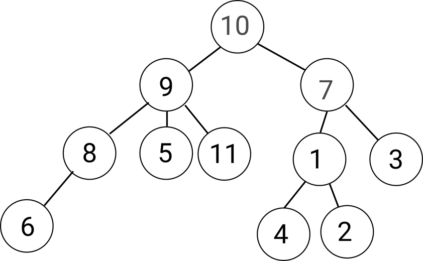

# Data Structure II

## Graph (Definition)

- In computer science, a graph is an **abstract data type**.
- A graph data structure consists of a finite set of **vertices** (also called **nodes** or **points**.)
- Lines between nodes are known as **edges** (also called **links** or **lines**), and for **a directed graph** are also known as **arrows**.


- **In a directed graph** direction matters. i.e. edge V2->V3 means that edge is directed. There is only an edge from V2 to V3 and no edge from V3 to V2. Therefore you can go from vertex V2 to vertex V3 but not from V3 to V2.

- **In undirected graph** V2-V3 means the edge has no direction, i.e. V2-V3 means you can go both from V2 to V3 and V3 to V2.

## Tree (Definition)

- Tree is a graph without a loop.
- Tree must have one and only one root


> Real Life Application of Tree:
>
> 1. DOM (Document Object Model)
> 2. File System in Operating System
> 3. Artificial Intelligence

### Tree Traversal

- Since tree is a commonly used data structure, we need a systematic way to know what nodes are in a tree.
- There are two ways to do tree traversal:
  1. Breadth-First Tree Traversal (See the [Code](Traversal%20Methods/Breadth-First.js))
  2. Depth-First Tree Traversal
     - PreOrder (See the [Code](Traversal%20Methods/PreOrder.js))
     - InOrder (See the [Code](Traversal%20Methods/InOrder.js))
     - PostOrder (See the [Code](Traversal%20Methods/PostOrder.js))



Use above methods to traverse this tree expect to get the results:

```javascript
// BFTT
breadthFirst(rootNode); // expect to get the result: [10, 9, 7, 8, 5, 11, 1, 3, 6, 4, 2]

// PreOrder
preOrder(rootNode); // expect to get the result: [10, 9, 8, 6, 5, 11, 7, 1, 4, 2, 3]

// InOrder
inOrder(rootNode); // expect to get the result: [6, 8, 9, 5, 11, 10, 4, 1, 2, 7, 3]

// PostOrder
postOrder(rootNode); // expect to get the result: [6, 8, 5, 11, 9, 4, 2, 1, 3, 7, 10]
```

### Binary Search Tree (BST)

- **Binary Tree** means each node has at most two children, which are referred to as the left child and the right child.
- **Binary Search Tree** is a binary tree, but the left child is always less than the root, and the right child is always greater than the root.
- See the [Code](Binary-Search-Tree.js)

> **Performance of Binary Search Tree**
>
> Worst Case Performance: $O(n)$
> Best Case Performance: $O(1)$
> Average Case Performance: $O(log$ $n)$

### Priority Queue

- In computer science, a priority queue is an abstract data type **similar to a regular queue** in which **each element additionally** has a "**priority**" associated with it.
- Elements with higher priorities are served before elements with lower priorities. (Just like emergency room in a hospital).
- Since priority queue is a concept, we can implement it with a linked list, queue, array, or other data structures. But… **Max Heap** is the most efficient!!

> **$*$** **Max heap** is a binary tree that the parent node is always greater than both the right child and left child. However, the right child doesn’t necessarily need to be greater than left child.
> ( Click to see [More](../Sorting%20Algorithms/README.md#2-heap-sort) about Max Heap & Heap Sort )

#### Why Max Heap?

- Big O of Enqueue and Dequeue of Priority Queue using Max Heap.
  > Enqueue: $O(log$ $n)$
  > Dequeue: $O(log$ $n)$
- Big O of Enqueue and Dequeue of Priority Queue using Array or LinkedList.
  > Enqueue: $O(n)$ (using insertion sort for a nearly sorted array)
  > Dequeue: $O(1)$ or $O(n)$ (LinkedList or Array)

#### Max Heap Insertion

- In heap sort, we learned how to build a max heap with a given array. Now, since priority queue is **dynamic**, which means that we will keep adding new items into max heap.
- The principle of dynamic max heap is simple, just keep swapping the new node up if necessary.

#### Math Relation in Priority Queue

- if **parent node** is **$x$**:
  > **left** child node is **$2𝑥+1$**  
  > **right** child node is **$2𝑥+2$**
- if **child node** is **$x$**:
  > **parent** node is **$Math.floor(\frac{x - 1}{2})$**

See the [Code](Priority-Queue.js)
