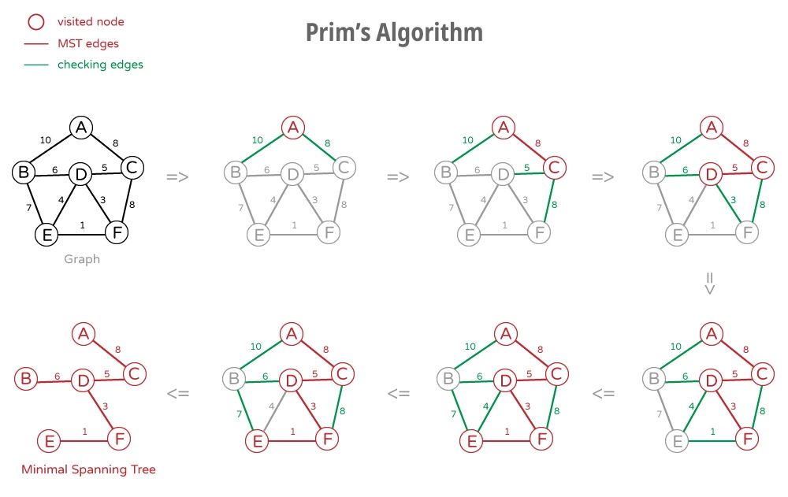

# Data Structure II

## Graph (Definition)

- In computer science, a graph is an **abstract data type**.
- A graph data structure consists of a finite set of **vertices** (also called **nodes** or **points**.)
- Lines between nodes are known as **edges** (also called **links** or **lines**), and for **a directed graph** are also known as **arrows**.


- **In a directed graph** direction matters. i.e. edge V2->V3 means that edge is directed. There is only an edge from V2 to V3 and no edge from V3 to V2. Therefore you can go from vertex V2 to vertex V3 but not from V3 to V2.

- **In undirected graph** V2-V3 means the edge has no direction, i.e. V2-V3 means you can go both from V2 to V3 and V3 to V2.

## Tree (Definition)

- Tree is a graph without a loop.
- Tree must have one and only one root


> Real Life Application of Tree:
>
> 1. DOM (Document Object Model)
> 2. File System in Operating System
> 3. Artificial Intelligence

### Tree Traversal

- Since tree is a commonly used data structure, we need a systematic way to know what nodes are in a tree.
- There are two ways to do tree traversal:
  1. Breadth-First Tree Traversal (See the [Code](Traversal%20Methods/Breadth-First.js))
  2. Depth-First Tree Traversal
     - PreOrder (See the [Code](Traversal%20Methods/PreOrder.js))
     - InOrder (See the [Code](Traversal%20Methods/InOrder.js))
     - PostOrder (See the [Code](Traversal%20Methods/PostOrder.js))


Use above methods to traverse this tree expect to get the results:

```javascript
// BFTT
breadthFirst(rootNode); // expect to get the result: [10, 9, 7, 8, 5, 11, 1, 3, 6, 4, 2]

// PreOrder
preOrder(rootNode); // expect to get the result: [10, 9, 8, 6, 5, 11, 7, 1, 4, 2, 3]

// InOrder
inOrder(rootNode); // expect to get the result: [6, 8, 9, 5, 11, 10, 4, 1, 2, 7, 3]

// PostOrder
postOrder(rootNode); // expect to get the result: [6, 8, 5, 11, 9, 4, 2, 1, 3, 7, 10]
```

### Binary Search Tree (BST)

- **Binary Tree** means each node has at most two children, which are referred to as the left child and the right child.
- **Binary Search Tree** is a binary tree, but the left child is always less than the root, and the right child is always greater than the root.
- See the [Code](Binary-Search-Tree.js)

> **Performance of Binary Search Tree**
>
> Worst Case Performance: $O(n)$
> Best Case Performance: $O(1)$
> Average Case Performance: $O(log$ $n)$

### Priority Queue

- In computer science, a priority queue is an abstract data type **similar to a regular queue** in which **each element additionally** has a "**priority**" associated with it.
- Elements with higher priorities are served before elements with lower priorities. (Just like emergency room in a hospital).
- Since priority queue is a concept, we can implement it with a linked list, queue, array, or other data structures. But… **Max Heap** is the most efficient!!

> **$*$** **Max heap** is a binary tree that the parent node is always greater than both the right child and left child. However, the right child doesn’t necessarily need to be greater than left child.
> ( Click to see [More](../Sorting%20Algorithms/README.md#2-heap-sort) about Max Heap & Heap Sort )

#### Why Max Heap?

- Big O of Enqueue and Dequeue of Priority Queue using Max Heap.
  > Enqueue: $O(log$ $n)$
  > Dequeue: $O(log$ $n)$
- Big O of Enqueue and Dequeue of Priority Queue using Array or LinkedList.
  > Enqueue: $O(n)$ (using insertion sort for a nearly sorted array)
  > Dequeue: $O(1)$ or $O(n)$ (LinkedList or Array)

#### Max Heap Insertion

- In heap sort, we learned how to build a max heap with a given array. Now, since priority queue is **dynamic**, which means that we will keep adding new items into max heap.
- The principle of dynamic max heap is simple, just keep swapping the new node up if necessary.

#### Math Relation in Priority Queue

- if **parent node** is **$x$**:
  > **left** child node is **$2𝑥+1$**  
  > **right** child node is **$2𝑥+2$**
- if **child node** is **$x$**:
  > **parent** node is **$Math.floor(\frac{x - 1}{2})$**

See the [Code](Priority-Queue.js)

### Encoding Theory

- In computing, all data are stored digitally in our devices. Briefly speaking, all digital files, including music, picture, video, string and numbers are just 0s and 1s.
- When storing files, what is the best way to perform “Lossless Compression”?

> $*$ In **Lossy compression**, A file does not restore or rebuilt in its original form. While in **Lossless Compression**, A file can be restored in its original form.

#### Huffman Encoding

- This is an algorithm developed by **David A. Huffman** while he was a Sc.D. student at MIT, and published in the 1952 paper "A Method for the Construction of Minimum-Redundancy Codes".
- The principle of Huffman encoding is, if a letter appears many times in a file, then it be compressed into short bits. On the other hand, a letter appears very less in a file, it can be compressed into more bits.

##### Example of Huffman Encoding

> **Try to compress: AAAABBB \_ \_ C**
>
> - Original: 000000000000001001001110110010 (30bits)
> - Huffman Encoding: 0000111111101101100 (19 bits)
>
> Can try it on the [Huffman Tree Generator](https://huffman.ooz.ie/)

#### Huffman Encoding - Compression

1. Read the file, count the frequency of each character.
2. Sort the frequency table.
3. According to the frequency table, constructor a Huffman Tree. Priority Queue is a good option for building Huffman Tree.
4. Generate Huffman codes for the nodes in Huffman Tree.
5. Read the whole file again and compress the file, according to the Huffman codes. Every byte can be written into the compressed file. (Java has BufferedOutputStream class to write raw byte data to a file. Node.js might have something similar.)

> $*$ At the beginning of the compressed file, include Huffman codes and its corresponding letter, as we need those information for decompression.

#### Huffman Encoding – Decompression

1. Read the information of Huffman Codes and its corresponding letters. Store the information in a Hashtable.
2. Read the compressed file, for each byte, we convert it back to 8 bits. Store the bits in an array. (I called it bitArray)
3. Read through bitArray, use left and right point algorithm to convert bits back to its corresponding letters.

### Minimal Spanning Tree

- If you have a graph, and selectively remove edges (without removing nodes) so that it forms a tree, what's left is called a **Spanning Tree**.
- That is, a spanning tree is a subset of the graph that has all the nodes of the original, but just enough edges to hold it together. For any graph, there are usually many possible spanning trees.
- However, the **Minimal Spanning Tree** is one whose edges have the smallest total weight. (This assumes a weighted graph; i.e. a graph in which each edge has a "weight" or a cost associated with it.)


#### **Prim’s Algorithm** of Finding MST

- Start at any node we want.
- Keep track of what nodes have been visited.
- Keep a list of edges. (These are the edges we use in building MST.)
- For all edges of visited node but not in MST edges list, find the smallest weighted edge that doesn’t create a cycle, and add the edge to the MST edge list. (Remember, **MST** is a tree, which should be **acyclic**.) (If the smallest weight graph is connected to two visited nodes that are in MST array, then the edge would create a cycle)
- Keep doing this until we come across a situation that a smallest weighted edge will 100% create a cycle. (That means that all nodes in this graph are in MST array) If we hit this point, then stop.



See the [Code](MST__Prim's-Algorithm.js)
