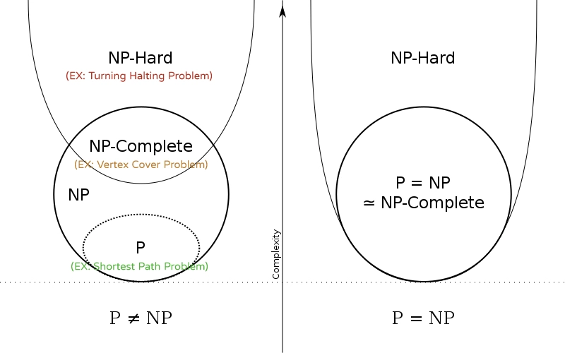

# P verses NP

> **Unsolved problem in computer science** | If the solution to a problem is easy to check for correctness, must the problem be easy to solve?

## Intro to P verses NP

- The P versus NP problem is a major unsolved problem in computer science. **It asks whether every problem whose solution can be quickly verified can also be solved quickly.**
- Most of the algorithms we learned in this course takes reasonable time to finish. By saying ”reasonable”, we mean seconds, minutes, or even hours. All of these algorithms are said to have "**polynomial complexity**" because the Big-O is in the form **$O(𝑛^𝑘)$**, where k is some constant.
- Problems whose solutions are algorithms with polynomial complexity are sometimes called **class-P** problems or "**easy**" problems.
- Some problems are solvable, but it takes a long time. (For example, 5000 Queens puzzle will take nearly $∞$ time to solve, based on the Computers/Deterministic Turing Machine we have nowadays.)
- These problems have no known fast algorithms to solve them, so we make do with slow inefficient algorithms. These algorithms have "superpolynomial" complexities like O(𝑘^𝑛). (Notice that n is the exponent, not the base. So as the input size grows, the complexity explodes.) We sometimes call these problems **class-NP** problems, or (more simply) "**hard**" problems.
  > $*$ the solutions of class-NP problems can be easily verified
- **P verses NP problem asks**: is it possible to find a fast algorithm to solve NP Problems with polynomial time? Do these kinds of algorithm exist?
- They might or not might exist. If they exist, humans might just not smart enough to find them. If they don’t exist, how do we prove that they don’t exist?
- It is one of the seven Millennium Prize Problems selected by the Clay Mathematics Institute, each of which carries a US$1,000,000 prize for the first correct solution.

## Understand NP problems

- An interesting fact about many "hard" problems is that, even although humans have not yet found a fast algorithm to solve the problem, however, if candidate solution for a given problem appears, _we CAN quickly and efficiently verify whether that solution is correct or not_; for most of the "hard" problems, **we have efficient algorithms for VERIFICATION**, but not for SOLUTION.
- A famous example is finding prime factors for very large numbers. Suppose you have a huge number (like 200 digits long. Really big) that is the product of two large primes. Supposed we only know the product but not the two factors. Human has not yet found any efficient solution to find the two factors. It takes a supercomputer 100 years to find these two prime factors. (According to the Fundamental Theorem of Arithmetic, **these two prime factors are unique**.)

> **Why do we care?**
>
> If an algorithm could be found to find prime factors of a LARGE NUMBER, then the modern cryptography will all become vulnerable!! You can literally break ciphers and security systems in the world.
> (A very strong cryptography algorithm, RSA, is secured based on the hardness of factorizing LARGE numbers.)

## Nondeterministic Polynomial

- P means “Polynomial time” algorithm to a problem could be found.
- NP doesn’t mean “Non-Polynomial time.” It stands for "nondeterministic polynomial" — meaning that an NP problem can be solved in polynomial time on a nondeterministic Turing machine. Since no one's ever built a nondeterministic Turing machine, we're out of luck. (REAL computers in real life are based on deterministic Turing machines, not nondeterministic.)
  \*. Turing Machine is the abstract ultimate computing machine that can simulate any algorithms in the world.

### Nondeterministic Turing Machine

- Deterministic Machines execute deterministic algorithms. Deterministic algorithms mean that this algorithm only make one choice in each step. All the algorithms we write are deterministic.
- Nondeterministic Algorithm means this algorithm makes more than one choice in each step. Only nondeterministic machine can execute this kind of algorithm. However, this kind of machine doesn’t exist, as it requires ∞ processors to execute codes parallelly.

- Most of the computer scientists believe that P does not equal NP.
- However, this has not been proved yet, therefore, it’s just people’s guess/hope.
- Quantum Computers might be able to solve NP-Complete problems in a much shorter amount of time, compared to supercomputers. We’ll see in the future.
- Due to the computing power of Quantum computers, scientists have been thinking of new cryptography algorithms, that is not depending on the difficulty of solving NP problems (Such as finding prime factors).

## NP-Completeness

- A problem is said to be NP-complete if:

  1. A brute-force algorithm can solve it, and the correctness of each solution can be verified quickly.
  2. The problem can be used to simulate any other problem with similar solvability.

- What does it mean? It means that a problem is NP-complete when the problem itself is NP problem; in addition, all NP questions can be **“reduced”** into a NP-complete problem in polynomial time.
- By "**reduction**" ("**changed**") we mean that we can quickly (that is, in polynomial time) convert one problem into another problem.

- NP-complete problems are the hardest problems in all NP problems. **NP-complete problems are the Kings among all NP problems.**
- If we find a polynomial time algorithm to solve any NP-complete problems, then the same algorithm can help us solve any other NP problems.
- Some common NP-Complete problems are SAT problems, 0/1 Knapsack problem, Vertex Cover, Hamiltonian Cycle, Travelling Salesman (TSP), Subset Problem, etc.

### NP-Complete Reduction

- All NP problems can be reduced to a NP-complete problem in polynomial time.
- NP-complete problems can reduced to another NP-complete problems in polynomial time as well.
- **We cannot reduce any NP-complete problems to NP problem.**
- The easiest way to prove that some new problem is NP-complete is first to prove that it is in NP, and then to reduce some known NP-complete problem to it.
- If problem A can be reduced to problem B, that means “B is at least as hard as A.” Probably B is even harder than A.
- If we can solve problem B in polynomial time, then we can use the same solution to solve problem A in polynomial time.

### Question

- If all NP-complete problem is proved by a known NP-complete problem, the: what is the first NP-complete problem in the world?
- In computational complexity theory, the **Cook–Levin theorem**, also known as Cook's theorem, states that the **Boolean satisfiability problem (SAT Problems)** is **NP-complete**. That is, it is in NP, and any problem in NP can be reduced in polynomial time by a deterministic Turing machine to the Boolean satisfiability problem.
- All other NP-complete problems we know in the world can be reduced from SAT problem.
  (By definition, any NP problem can be reduced to an NP-complete problem in polynomial time. Since NP-complete problems are themselves NP problems, **all NP-complete problems can be reduced to each other in polynomial time**.)

### General Sequence of NP-Complete Problems

  

- From top to bottom, a problem can be reduced to another problem in polynomial time.
- All problems on this list are NP-complete.

> As you might guess, no one has found any efficient algorithm to solve any NP-complete problems, other than BRUTE-FORCE approach. (Trying out all possible combinations and seeing what happened.)

## NP-Hardness

NP-hard problems are those **at least as hard as the hardest NP problems**; NP-hard problems need not be in NP; i.e., **they need not have solutions verifiable in polynomial time**.

  

### SAT Problem

- SAT stands for **satisfiability**. The whole name for SAT problem is **“Boolean satisfiability problem”**.
- The SAT problem is basically: given a CNF expression, is there a way to assign values to its variable that will make the whole expression true?
- For example:

  $$(A + B’ +C)(A’ + C’ + D’)(A’ + B + D)(A + B + C’) = true$$

- If there are **$N$** different variables, then time complexity of brute force will be **$𝑂(2^𝑁)$**.

### Sum of Subset Problem

- Subset sum problem is to find subset of elements that are selected from a given set whose sum adds up to a given number K.
- Supposed we have a set `S = {10, 15, 9, 12, 16, 21, 3, 6}`. What **subset of S** satisfies that the sum of elements will add up to **24**?
  **$$S = \{10, 15, 9, 12, 16, 21, 3, 6\}$$**

  **$$⇓$$**

  $$(S_1 = \{15,\ 9\},\ S_2 = \{15,\ 3,\ 6\},\ S_3 =\ ...\ etc)$$

- If there are **$N$** different elements in S, then time complexity of brute force will be **$𝑂(2^𝑁)$**.
  > Count of subsets of $S$ => $C^N_0 + C^N_1 + C^N_2 + ...\ + C^N_N = 2^N$
