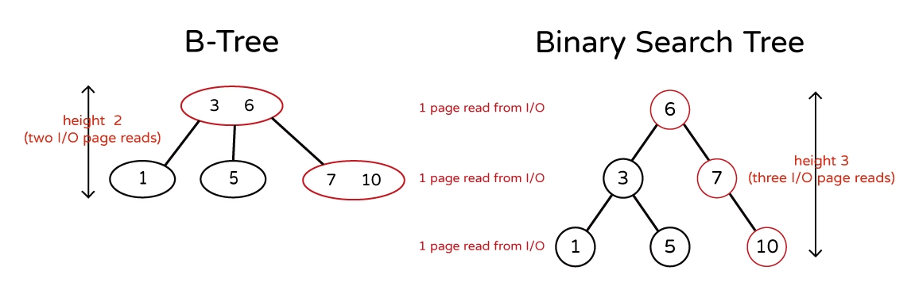

# Self-Balance Tree

List of Contents:
- [Imbalance Tree](#imbalance-tree)
- [B-Tree](#b-tree)
  - [M-Way Search Tree](#m-way-search-tree)
  - [Definition of B-Tree](#definition-of-b-tree)
  - [Databases and B$^+$Tree](#databases-and-btree)
    - [B-tree vs Binary Search Tree (BST)](#b-tree-vs-binary-search-tree-bst)
    - [B$^+$Tree vs B-Tree](#btree-vs-b-tree)
- [AVL Tree （Adelson-Velsky and Landis Tree）](#avl-tree-adelson-velsky-and-landis-tree)
  - [Balance factor](#balance-factor)
  - [Rotation Subroutine](#rotation-subroutine)
- [Red-Black Tree](#red-black-tree)
  - [Strategies in Red-Black Tree](#strategies-in-red-black-tree)
  - [Why Red-Black Trees?](#why-red-black-trees)
  - [Red-Black Trees vs AVL Tree:](#red-black-trees-vs-avl-tree)

---

## Imbalance Tree

Suppose we are inserting elements into a binary search tree (BST), but the order of insertion is 10, 20, 30, ..., 60, then we get a BST in this shape:


> There is no difference between this BST and a simple array. The search, deletion, and insertion time complexity are both $O(n)$.

To solve the imbalance tree structure, there are mainly 3 approaches:

1. B-Tree and B$^+$Tree
2. AVL Tree
3. Red-Black Tree

## B-Tree

B-trees were invented by Rudolf Bayer and Edward M. McCreight while working at Boeing Research Labs in 1970 to manage index pages for large random-access files efficiently. B-trees are self-balanced trees (but not binary).

### M-Way Search Tree

In an m-Way tree of order **$m$**, each node contains a maximum of "**$m$ – 1**" elements (**$m$ - 1** keys) and **$m$** children (m-ways to choose where to go).


> B-Tree is based on the structure of the m-way search tree.

### Definition of B-Tree

A B-tree of order m is an m-way search tree such like that:

1. Every node has at most m children.
1. Every internal node (except the root node) has at least **$⌈m/2⌉$** children. (ex: $⌈24.001⌉$ = Math.ceil(24.001) = 25)
1. Every non-leaf node has **at least two children**.
1. All leaves appear on the same level and carry no information.
1. A non-leaf node with **$k$** children contains **$k−1$** keys.


### Databases and B$^+$Tree

The real world databases use B$^+$Tree, which is pretty much the same as B-Tree, but better.

1. BST is good for RAM but not suitable for disk I/O. In a real world database, we cannot load all data into RAM; therefore, we must read data from the disk I/O, not form RAM. Unfortunately, disk I/O is expensive (slow).
2. When reading data from disk I/O, the minimum amount of data we read is called a "page". (Usually, a page size of a disk between 512 to 8196 bytes, with 4096 being a typical value.)

#### B-tree vs Binary Search Tree (BST)



With these two constrains in mind, B-Tree aims to put more data in a node (to reduce the height of a tree structure); then, each time when we access a node and retrieve from disk I/O, we get more data.

A dataset 1, 3, 5, 6, 7, 10 stored in a B-Tree with order 3 needs only 2 I/O page reads to find node 10, where as BST needs 3 I/O page reads.

Since data retrieval from disk I/O is expensive, B-Tree reduces the number of data retrieval bu putting more data in a node (or a page in disk I/O).

Most database utilize the feature. Suppose a disk I/O page size is 4096 bytes. In a SQL relational database, if a table row needs 1000 bytes to be stored, then 4 rows from node in B-Tree or a page in disk I/O. That means, this B-Tree will be order 5. If a table row needs 500 bytes to be stored, then 8 rows from node in B-Tree; that means, the database will be a B-Tree of order 9.

#### B$^+$Tree vs B-Tree

**However, B-Tree has some problems:**

1. Search time is not consistent. The nodes closer to the root gets found a lot faster.
2. Suppose we need to find all data rows bigger than 2 in this B-Tree. Then, we have to do tree traversal to the whole B-Tree, but each node access cost time to retrieve data from disk I/O.
3. B-Tree has to be reconstructed if we change the table structure. If a data row size grows from 1000 bytes to 2000 bytes, then a page in disk I/O or a node in B-Tree can store from 4 rows of data to 2 rows of data.
4. Chaining the table of structure results in more layer in B-Tree, which means the time complexity for searching will increase.
   > B$^+$Tree solves all these problems!

**B$^+$Tree is a B-Tree with the following rules:**

1. All non-leaf nodes store pointers to the actual data, not the actual data itself.
2. Only leaf nodes store data.
3. Each leaf node is connected in a **linked list**.


The benefits of using B$^+$Tree include:

1. Since each non-leaf node store pointers only, we can put more stuff in a node. (The size of pointer is usually much less than the size of actual data.) More keys in each non-leaf node result in less layer in the whole B$^+$Tree.
2. It creates layers of pointers in disk I/O. Each page read from disk I/O leads to the next layer of pointers.
3. Increase table row size doesn't affect pointer size, so one page can store constant number of pointers.
4. Searching all data bigger than somthing is simple. Go to the right or left of the linked list and select all of them. (Faster and more accessible than doing tree traversal)

The downside of the B$^+$Tree is, unless we rebuild the whole B$^+$Tree, we cannot change the size of the primary key. (That's why most databases restrict the size of names to 70 characters.)

Famous relational databases, such as MySQL, SQLite, and Microsoft SQL Server, use B$^+$Tree in their DBMS. NTFS (new technology file system) uses B$^+$Tree, and EXT4 (extended file system) in Linux uses extent trees (a modified B$^+$Tree data structure) for file extent indexing.

**$*$ The difference between B-tree and B+ tree:**
| Basis of Comparision | B tree | B$^+$Tree |
|----|----|----|
|Pointers|All internal and leaf nodes have data pointers| Only leaf nodes have data pointers|
|Search| Since all keys are not available at leaf, search often takes more time.| All keys are at leaf nodes, hence search is faster and more accurate.|
|Redundant Keys |No duplicate of keys is maintained in the tree. |Duplicate of keys are maintained and all nodes are present at the leaf.|
|Insertion | Insertion takes more time and it is not predictable sometimes.| Insertion is easier and the results are always the same.|
|Deletion| Deletion of the internal node is very complex and the tree has to undergo a lot of transformations.| Deletion of any node is easy because all node are found at leaf.|
|Leaf Nodes| Leaf nodes are not stored as structural linked list. |Leaf nodes are stored as structural linked list.|
|Access| Sequential access to nodes is not possible| Sequential access is possible just like linked list|
|Height| For a particular number nodes height is larger| Height is lesser than B tree for the same number of nodes|
|Application| B-Trees used in Databases, Search engines| B+ Trees used in Multilevel Indexing, Database indexing|
|Number of Nodes |Number of nodes at any intermediary level ‘l’ is 2l. |Each intermediary node can have n/2 to n children.|

## AVL Tree （Adelson-Velsky and Landis Tree）

AVL tree is a self-balancing binary search tree (BST). A tree can balance itself by rotating itself.


### Balance factor

The balance factor of a node in an AVL tree is the height of the left subtree minus the height of the right subtree. If the balance factor of a node **$∈ \{-1,\ 0,\ 1\}$**, then the node is balanced. If the absolute value of a node's balance factor is greater than 1, then it's an imbalance node.


- **$BF < -1$** means "**left-heavy**"
- **$-1 <= BF <= 1$** means "**balanced**"
- **$BF > 1$** means "**right-heavy**"

### Rotation Subroutine

There are 4 types of rotation subroutine to perform in AVL tree:

1. LL Rotation
   ```
   T1, T2, T3 and T4 are subtrees.
            z                                      y
           / \                                   /   \
          y   T4      Right Rotate (z)          x      z
         / \          - - - - - - - - ->      /  \    /  \
        x   T3                               T1  T2  T3  T4
       / \
     T1   T2
   ```
2. LR Rotation
   ```
        z                                  z                               x
       / \                               /   \                            /  \
      y   T4    Left Rotate (y)         x    T4    Right Rotate(z)      y      z
     / \        - - - - - - - - ->     /  \        - - - - - - - ->    / \    / \
   T1   x                             y    T3                        T1  T2 T3  T4
       / \                           / \
     T2   T3                       T1   T2
   ```
   > Tip: Set x to z's position and set z to Right child node's position.
3. RR Rotation
   ```
         z                                   z                               x
        / \                                /   \                            /  \
       y   T4    Left Rotate (y)          x    T4    Right Rotate(z)      y      z
      / \        - - - - - - - - ->      /  \        - - - - - - - ->    / \    / \
    T1   x                              y    T3                        T1  T2 T3  T4
        / \                            / \
      T2   T3                        T1   T2
   ```
4. RL Rotation
   ```
       z                                z                                x
      / \                              / \                              /  \
    T1   y     Right Rotate (y)      T1   x       Left Rotate(z)      z      y
        / \    - - - - - - - - ->       /  \     - - - - - - - ->    / \    / \
       x   T4                          T2   y                      T1  T2  T3  T4
      / \                                  /  \
    T2   T3
   ```
   > Tip: Set x to z's position and set z to Left child node's position.

$*$ References: [https://www.geeksforgeeks.org/avl-tree-set-1-insertion/](https://www.geeksforgeeks.org/avl-tree-set-1-insertion/)

## Red-Black Tree

In 1972, Rudolf Bayer[5] invented a data structure that was a special order-4 case of a B-tree.
A red-black tree is a kind of self-balancing binary search tree with the following rules:

1. Every node has a color either red or black.
2. The root of the tree is always black.
3. All leaf nodes (NIL) are black nodes. (value must be NULL)
4. There are no two adjacent red nodes (A red node cannot have a red parent or red child).
   > If a node is red, then its children are black. (This does not mean that if a node is black, its children must be black; this is why this data structure is called red-black tree, not black-red tree)
5. Every path from a node (including root) to any of its descendants NULL nodes has the same number of black nodes. (This is usually known as black-height. When calculating black-height, we won't count the starting node.)

### Strategies in Red-Black Tree

When inserting a node Z into a red-black tree, the basic steps are:

1. Z insertion uses the same algorithm as BST. Color Z red.
2. Recolor Z or rotate neighbor nodes to fix violations.

After insertion, Z's parent node might be red. Therefore, we need to fix the red-red situation by:

- Case 0: If the tree is empty, insert Z and color Z red. However, the root cannot be a red node; therefore, set Z bl ack.
  
- Case 1: Z's uncle is red, Then recolor Z's grandparent to be red, parent and uncle to be black. Set Z to be Z's grandparent.
  
- Case 2: Z's uncle is black, and (Z, Z's parent, and Z's grandparent) from a triangle. Then, rotate Z's parent. Set Z to be Z's parent.
  
  > $*$ Notice: the red-red situation in Case 2 can be solved by Case 3.
- Case 3: Z's uncle is black, and (Z, Z's parent, and Z's grandparent) from a line. Then, rotate Z's grandparent. After rotation, color Z's new parent to be black, Z's new sibling red.
  

| Scenarios                             | Solution                                                                |    New Z    |
| ------------------------------------- | ----------------------------------------------------------------------- | :---------: |
| Z is root                             | Color Z black                                                           |    None     |
| Z's uncle is red                      | Color grandparent red, parent and uncle black                           | grandparent |
| Z's uncle is black with triangle form | Rotate Z's parent                                                       |   parent    |
| Z's uncle is black with line form     | Rotate Z's grandparent, and color Z's new parent black, new sibling red |    None     |

### Why Red-Black Trees?

Most of the **BST** operations (e.g., search, max, min, insert, delete.. etc) take **$O(h)$** time where **$h$ is the height of the BST**.

The cost of these operations may become **$O(n)$** for a skewed Binary tree.

If we make sure that the height of the tree remains **$O(log\ n)$** after every insertion and deletion, then we can guarantee an upper bound of **$O(log\ n)$** for all these operations.
The height of a **Red-Black tree** is always **$O(log\ n)$** where n is the number of nodes in the tree.

### Red-Black Trees vs AVL Tree:

he AVL trees are more balanced compared to Red-Black Trees, but they may cause more rotations during insertion and deletion. So if your application **involves frequent insertions and deletions, then Red-Black trees should be preferred**. And if the insertions and deletions are less frequent and search is a more frequent operation, then AVL tree should be preferred over the Red-Black Tree.
